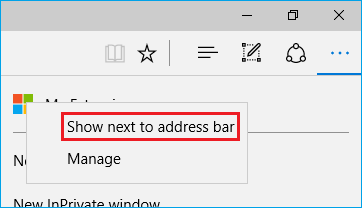

# プレビュービルドのMicrosoft Edgeで拡張を追加または削除する
拡張がWindows 10のメインストリームビルドに完全に取り込まれると、Windows Storeから入手し利用できるようになります。それまでの間は[https://dev.windows.com](http://www.aka.ms/msedge-extensions)からダウンロードしたパッケージングされていない拡張を読み込ませることができます。Microsoft Edgeで拡張を追加または削除する方法は続きをお読みください。

## 拡張を追加する

1. Microsft Edgeを開き、[https://dev.windows.com](http://www.aka.ms/msedge-extensions)から拡張をダウンロードします

2. ダウンロード通知から**"Run"**を選択します

     

3. **"More (...)"**を選択して、メニューを開きます

     

4. **"Extensions"**をメニューから選択します

5. **"Load extension"**ボタンを選択します

6. 拡張のフォルダーを選択します
> **"Downloads"**にある**"MSEdge Extensions Preview - ..."**で始まるものを探してください

7. **"Select folder"**ボタンを選択します

**これで完了です!Microsoft Edgeに拡張が並んでいるのを確認できるはずです!**

## 拡張ボタンを移動する

"Mouse Gestures"のような拡張のいくつかは**"More" (...)**メニューにボタンを追加します。

     

もし素早くアクセスするためにボタンをメニューの外に移動したければ:

1. 拡張ボタンを右クリックします

2. **"Show next to address bar"**を選択します

     

>右クリックして**"Show next to address bar"**の選択を解除することで、いつでもボタンを**"More" (...)**に戻せることを覚えておいてください

## 拡張を削除する

1. Microsoft Edgeを開きます

2. **"More (...)"**を選択して、メニューを開きます

3. **"Extensions"**をメニューから選択します

4. 削除したい拡張を右クリックして、**"Remove"**を選択します

     

**拡張はMicrosoft Edgeのリストから消えるはずです**

