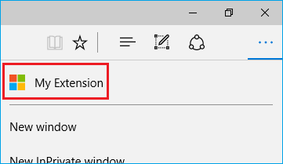

<!-- # Adding and removing extensions for preview builds of Microsoft Edge -->
# プレビュービルドのMicrosoft Edgeで拡張を追加または削除する

<!-- When fully released to mainstream builds of Windows 10, extensions will be available via the Windows Store. Until that time you can load unpacked extensions downloaded from [https://dev.windows.com](http://www.aka.ms/msedge-extensions). Continue reading for information on how to add and remove your extensions in Microsoft Edge. -->

拡張がWindows 10のメインストリームビルドに完全に取り込まれると、Windows Storeから入手し利用できるようになります。それまでの間は[https://dev.windows.com](http://www.aka.ms/msedge-extensions)からダウンロードしたパッケージングされていない拡張を読み込ませることができます。Microsoft Edgeで拡張を追加または削除する方法は続きをお読みください。

<!-- ## Adding an extension -->
## 拡張を追加する

<!--
1. Open Microsoft Edge and download an extension from [https://dev.windows.com](http://www.aka.ms/msedge-extensions).

2. Select **"Run"** from the downloads notification.

     

3. Select **"More (...)"** to open the menu.

     

4. Select **"Extensions"** from the menu.

5. Select the **"Load extension"** button.

6. Choose the extension folder.
> Look for the one starting with **"MSEdge Extensions Preview - ..."** in your **"Downloads"** folder.

7. Select the **"Select folder"** button.
-->
1. Microsft Edgeを開き、[https://dev.windows.com](http://www.aka.ms/msedge-extensions)から拡張をダウンロードします

2. ダウンロード通知から**"Run"**を選択します

     

3. **"More (...)"**を選択して、メニューを開きます

     

4. **"Extensions"**をメニューから選択します

5. **"Load extension"**ボタンを選択します

6. 拡張のフォルダーを選択します
> **"Downloads"**にある**"MSEdge Extensions Preview - ..."**で始まるものを探してください

7. **"Select folder"**ボタンを選択します

<!-- **You're all set! You should now see the extension listed in Microsoft Edge!** -->

**これで完了です!Microsoft Edgeに拡張が並んでいるのを確認できるはずです!**

<!-- ## Moving the extension button -->
## 拡張ボタンを移動する

<!-- Some extensions (like "Mouse Gestures") add a button to the **"More" (...)** menu. -->

"Mouse Gestures"のような拡張のいくつかは**"More" (...)**メニューにボタンを追加します。

     

<!-- If you want to move the button out of this menu for easier access: -->

もし素早くアクセスするためにボタンをメニューの外に移動したければ:

<!-- 
1. Right-click the extension button.

2. Select **"Show next to address bar"**.

     

 >Remember, you can always move the button back to the **"More" (...)** menu by right-clicking it and unselecting **"Show next to address bar"**.
-->

1. 拡張ボタンを右クリックします

2. **"Show next to address bar"**を選択します

     

>右クリックして**"Show next to address bar"**の選択を解除することで、いつでもボタンを**"More" (...)**に戻せることを覚えておいてください

<!-- ## Removing an extension -->
## 拡張を削除する

<!--
1. Open Microsoft Edge.

2. Select **"More (...)"** to open the menu.

3. Select **"Extensions"** from the menu.

4. Right-click the extension you want to remove and select **"Remove"**.

     
-->

1. Microsoft Edgeを開きます

2. **"More (...)"**を選択して、メニューを開きます

3. **"Extensions"**をメニューから選択します

4. 削除したい拡張を右クリックして、**"Remove"**を選択します

     

<!-- **The extension should disappear from the list in Microsoft Edge** -->
**拡張はMicrosoft Edgeのリストから消えるはずです**
