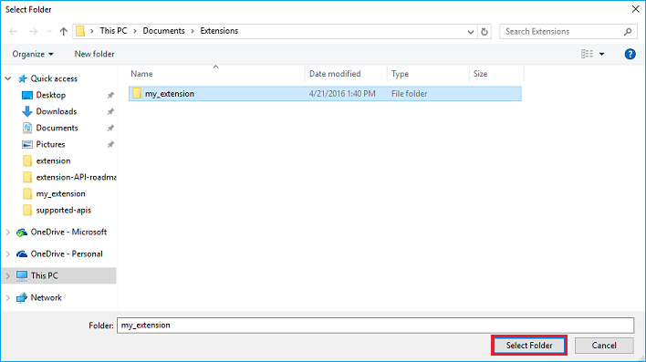

# Microsoft Edgeで拡張を追加または削除する
拡張が完全にリリースされると、Windows Storeから入手し利用できるようになります。それまでの間は作成した拡張を読み込ませることができます。Microsoft Edgeで拡張を追加または削除する方法は続きをお読みください。

## 拡張を追加する

1. Microsft Edgeを開き、アドレスバーに'about:flags'を入力します

2. "Enable extension developer features" チェックボックスをチェックします

   

3. **More (...)** を選択して、メニューを開きます

     

4. **Extensions**をメニューから選択します

5. **Load extension**ボタンを選択します

   

6. 拡張のフォルダーを開き、 **Select folder** ボタンを選択します
   
>ノート: 拡張を読み込む際にエラーメッセージが表示された場合には、[トラブルシューティング](../../troubleshooting)のページのアドバイスを参照してください

**これで完了です!Microsoft Edgeの拡張ペインに拡張が並んでいるのを確認できるはずです!**

> ノート: 未署名の拡張はMicrosoft Edgeの起動後に自動的に無効化されます。ブラウザーがアイドル状態(非アクティブになっておおよそ10秒後)にウィンドウの下部に通知が表示されます。 未署名の拡張を有効にするには "Turn on anyway" をクリックします。 

## 拡張ボタンを移動する
拡張の設定によっては**More (...)**メニューに表示されます。

     

もし素早くアクセスするためにボタンをメニューの外に移動したければ:

1. 拡張ボタンを右クリックします

2. **Show button next to address bar**を選択します

     

You can also do this from the extensions details page by:
拡張の詳細ページからも同様の設定が可能です:

1. 拡張ボタンをクリックします
2. **Show button next to address bar**をオンにします

   

> ノート: 右クリックして**Show next to address bar**の選択を解除する、または、拡張の詳細で**Show button next to address bar**をオフにすることでいつでもボタンを**More (...)**に戻せます

## 拡張を削除する

1. Microsoft Edgeを開きます

2. **More (...)** を選択して、メニューを開きます

3. **Extensions**をメニューから選択します

4. 削除したい拡張を右クリックして、**Remove**を選択する、または拡張を選択して**Remove"**ボタンを選択します

     

**拡張はMicrosoft Edgeのリストから消えるはずです**

