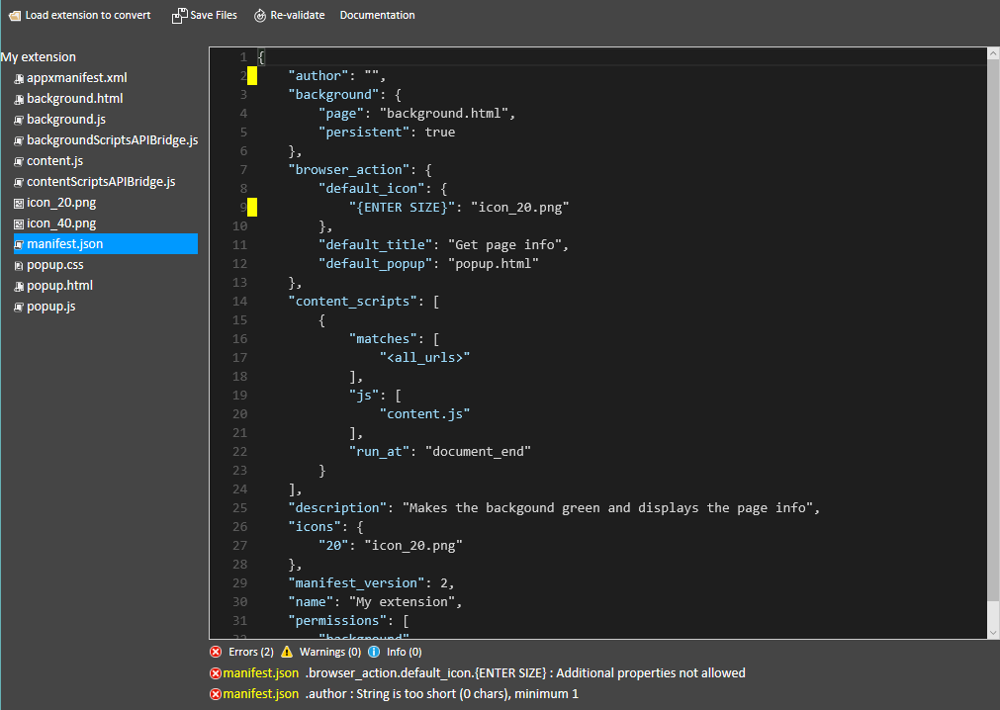

# 拡張をChromeからMicrosoft Edgeに移植する

拡張をChromeからMicrosoft Edgeに移植するのは[Microsoft Edge Extension Toolkit](https://www.microsoft.com/store/p/microsoft-edge-extension-toolkit/9nblggh4txvb)の助けを借りれば簡単に行えます。この開発者ツールはAPIをブリッジするとともに `manifest.json` ファイルにあるエラーを明らかにし、パッケージ化されていないChromeの拡張をパッケージ化されていないMicrosoft Edgeの拡張へと変換します。


### API ブリッジ
Chrome APIからMicrosoft EdgeのAPIへシームレスな移植を可能にするため、2つのスクリプトが拡張のフォルダーに追加されます。それらのスクリプトはAPIをブリッジ(必要に応じてpolyfil)するため、バックグラウンドスクリプトまたはコンテンツスクリプトに含まれるChrome固有のコードの変更について心配する必要はないということを意味します。

変換後、拡張のマニフェストファイルに `"-ms-preload"` キーとともに以下の項目が含まれていることに気がつくでしょう: 
```json
"-ms-preload": {
  "backgroundScript": "backgroundScriptsAPIBridge.js",
  "contentScript": "contentScriptsAPIBridge.js"
}
```

## Microsoft Edge Extension Toolkitを利用する
以下の手順はChromeの拡張をWindows 10 Anniversary Update エディションのMicrosoft Edgeでを変換し動かす方法についてです:

1. [Microsoft Edge Extension Toolkit](https://www.microsoft.com/store/p/microsoft-edge-extension-toolkit/9nblggh4txvb)をインストールします
2. Chromeの拡張のフォルダーを安全のためにコピーします。変換処理はコードを上書きします 
3. Microsoft Edge Extension Toolkit を実行し、拡張のコピーを読み込みます
 
4. ツールのテキストエディターに報告されるすべてのエラーを修正します。修正した後、"Re-validate" を選択してエラーをチェックします  
 
5. "Save files" を選択します

これでToolkitを終了して、拡張をMicrosoft Edgeで読み込めます!

既知のプラットフォームの問題を[EdgeHTML issue tracker](http://issues.microsoftedge.com)で探すことができます。もし新しい問題を見つけたと思ったら[issueをオープンしてください](https://developer.microsoft.com/en-us/microsoft-edge/platform/issues/new/)!
