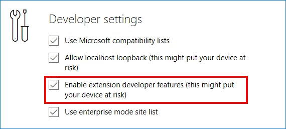

## トラブルシューティング

[https://dev.windows.com](http://www.aka.ms/msedge-extensions)からダウンロードしたパッケージングされていない拡張を読み込ませようとし、問題に遭遇した際には次のトラブルシューティングのトピックが役立つかもしれません:

### 1. "We couldn't load this extension"と表示された

これは、読み込ませようとした際にMicrosoft Edgeが拡張のフォルダーにアクセスできなかったことを意味することが大体です。拡張のフォルダーを削除して、.EXEを再度実行して、**Downloads**に作成された拡張のフォルダーからの読み込みを試してみてください。

以下は遭遇するかもしれない可能性のあるエラーの一覧です:

Error message | Details
:--------- | :------------
Manifest parsing error: Missing or malformed manifest file. | Either the file `"manifest.json"` was not found in the specified location or there is something wrong with the file. To resolve the issue, ensure that the specified folder contains the manifest at the top-level, and double-check your commas, quotes and brackets.
Manifest parsing error: `"content_scripts"` must define an array. | The field `"content_scripts"` should be an array. To resolve the issue, double-check your syntax. For example: `"content_scripts": [{"matches": [...],"css": [...],"js": [...] }]`
Manifest parsing error: `"content_scripts"` must define value for `"matches"` property. | The property `"matches"` is required. To resolve the issue, specify the property’s value with an array of strings. For example: `"content_scripts": [ {... "matches": ["http://www.bing.com"] ...} ]`
Manifest parsing error: `"content_scripts"` must reference at least one .css or .js file. | At least one property `"css"` or `"js"` is required. To resolve the issue, specify the property’s value with an array of strings. For example: `"content_scripts": [ { ... "js": ["myScript1.js", "myScript2.js"] ...} ]`
Manifest parsing error: `"<field>"` must define value for "<property>" property. | The property `<property>` for the field `<field>` is required. To resolve the issue, specify a valid value for `<property>`.
Manifest parsing error: `"content_scripts"` references invalid value for "run_at" field. | The property `"run_at"` specifies an unknown value. To resolve the issue, specify one of `"document_start"`, `"document_end"` or `"document_idle"`. For example: `"content_scripts": [ {... "run_at": "document_start" ... } ]`
Manifest parsing error: Missing `"<field>"` field. | The field `<field>` is required. To resolve the issue, define the field with a valid value.
Manifest parsing error: Invalid field `"<field1>"` found in `"<field2>"`. | The field <field1> for the field <field2> specifies an unknown value. To resolve the issue, specify a valid value for <field1>.
Manifest parsing error: Invalid value for "<field>" field. | The field <field> specifies an unknown value. To resolve the issue, specify a valid value.
Manifest parsing error: Extension is not supported by current version of Microsoft Edge. | The property `"minimum_edge_version"` specifies a more recent version of Microsoft Edge than the one you own. You can find the current version by opening the "..." (More) menu and then selecting "Settings" (bottom section "About this app"). To resolve the issue, either update your browser to a newer version or change the value in the manifest. For example: `"minimum_edge_version": "x.xxxx.xxxx.x"`
Manifest parsing error: `"background"` must define value for "page" or "scripts" property. | The property "page" or "scripts" is required for the field "background". To resolve the issue, specify a string for "page" or an array of strings for "scripts". For example: `"background": { ... "scripts": ["background.js"] ... }`
Manifest parsing error: `"background"` must define value for `"persistent"` property. | The property `"persistent"` is required. To resolve the issue, specify a true or false value. For example: `"background": {... "persistent": true ...}`
Manifest parsing error: Only one `"browser_action"` or `"page_action"` can be defined. | An extension cannot define both a page action and a browser action at the same time. To resolve the issue, remove either one of the definitions.
Unspecified error: `<error>` | Generic catch-all error message. `<error>` will be replaced by the specified error.

### 2. "Load extension"ボタンが見つからない
拡張がWindows Storeから利用できるようになるまでの間、このボタンはデフォルトで表示されている*はず*です。もし"More" (...)メニューを開いて、"Extensions"メニュー項目を選択し、ボタンが見つからない場合には次の手順をお試しください:
 
1. アドレスバーに**"about:flags"**を入力して、**"Enter"**キーを押します
2. **"Developer settings"**項目にある、**"Enable extension developer features"**チェックボックスが選択されているか確認します

     

3. Microsoft Edgeを閉じて、再度開きなおし、**"Load extension"**ボタンが表示されることを確認します